<p align="center">
  
</p>

<p align="center">
  
</p>

<p align="center">
  
  
  
  
</p>

<p align="center">
  
</p>

## ⌖&nbsp;&nbsp;The Concept

Most people run their life through a dozen disconnected apps — one for
habits, one for budgeting, one for courses, one for community. SYD OMEGA
91717 exists to end that fragmentation. It is a single, private realm
where everything that makes up a life — discipline, growth, wealth,
creativity, and the people around you — lives under one roof, one
identity, and one design.

Nothing about it is generic. Every corner of the platform is woven into a
single, coherent mythology of signs, elements, and guiding personas — not
as decoration, but as the map itself. Learn your sign and your element
once, and you already know your way through every realm.

This is deliberately not a product anyone can just sign up for. Entry is
by invitation, every request is reviewed by hand, and the realm stays
small on purpose. **Sovereign** is not a slogan here — it describes who
holds the keys: the platform is governed by a single Architect, and your
data, once inside, is yours to see, export, or erase, at will.

<p align="center">
  
</p>

## ◈&nbsp;&nbsp;Explore The Realms

The platform unfolds into nine realms once you're inside, each with its
own identity, color, and purpose — reached from a single sidebar that
never changes shape as you move between them.

<table>
<tr>
<td align="center" width="140"><br><b>Command</b></td>
<td>Your dashboard — a live snapshot of your progress, alerts, quick search, and the in-app AI concierge.</td>
</tr>
<tr>
<td align="center"><br><b>Identity</b></td>
<td>Your profile, membership passport, and account settings.</td>
</tr>
<tr>
<td align="center"><br><b>Ascend</b></td>
<td>Habit tracking, the Academy, challenges, achievements, trophies, and exams.</td>
</tr>
<tr>
<td align="center"><br><b>Cosmos</b></td>
<td>Your sign, your element, the AI agent personas, and the platform's lore.</td>
</tr>
<tr>
<td align="center"><br><b>Vault</b></td>
<td>Portfolio, wallet, subscriptions, and the members' marketplace.</td>
</tr>
<tr>
<td align="center"><br><b>Order</b></td>
<td>Family and household tools, shared halls, and community groups.</td>
</tr>
<tr>
<td align="center"><br><b>Services</b></td>
<td>Consultancy, publishing, a production studio, marketing, events, travel, and wellness.</td>
</tr>
<tr>
<td align="center"><br><b>Intel</b></td>
<td>Research, personal analytics, automation, and platform governance.</td>
</tr>
<tr>
<td align="center"><br><b>Universe</b></td>
<td>The media library and creative content hub.</td>
</tr>
</table>

Every realm shares the same design language, so the moment you're
comfortable in one, the rest already feels familiar.

<p align="center">
  
</p>

## ▲&nbsp;&nbsp;The Path to Membership

<table>
<tr>
<td align="center" width="70"><b>I</b></td>
<td><b>Request</b> — submit an account request through the platform.</td>
</tr>
<tr>
<td align="center"><b>II</b></td>
<td><b>Review</b> — every request is reviewed personally; while pending, a live status page shows where things stand.</td>
</tr>
<tr>
<td align="center"><b>III</b></td>
<td><b>Approval</b> — once approved, your dashboard and every realm above unlock.</td>
</tr>
<tr>
<td align="center"><b>IV</b></td>
<td><b>Ascension</b> — complete your profile to claim your sign, element, and starting rank.</td>
</tr>
</table>

Membership is never purchased or auto-unlocked. It is earned through
approval, by design — that's what keeps the realm trusted and personal.

<p align="center">
  
</p>

## ☉&nbsp;&nbsp;Using the Platform

- **Command** is home base — start every session there for a snapshot of
  what matters most.
- The sidebar is your compass — each icon maps directly to a realm above.
- Build momentum in **Ascend** — habits and challenges compound into your
  standing over time.
- Manage your holdings in **Vault**.
- Whenever you need guidance, the AI concierge in **Command** is always
  one click away.

<p align="center">
  
</p>

## Ω&nbsp;&nbsp;Your Privacy, Your Sovereignty

Your data belongs to you — that's the point of "sovereign." The in-app
Privacy Centre lets you see exactly what's stored, control your consent
preferences, export your data, and request permanent deletion of your
account at any time. Full terms live in-app under **Privacy** and
**Terms**.

<p align="center">
  
</p>

## ⚙️&nbsp;&nbsp;Platform Architecture

**Static HTML, No Build Step.** Every page is a self-contained `.html` file served directly by Vercel. The platform loads zero JavaScript frameworks — shared behavior comes from a "nervous system" (`bg.js`) injected into every page at runtime, which dynamically loads specialized modules (`omega-*.js`) on demand.

**Backend: Supabase + Row-Level Security.** All data access goes through Supabase's PostgREST API using RLS policies as the authorization boundary — not application code. Every table has RLS enabled; the anon/publishable key is public by design (no secrets client-side).

**No Artificial Fragmentation.** The entire platform shares one design system (colors, fonts, spacing, components defined in `bg.js`), one auth state, and one sidebar navigation — so a member's identity and position is consistent across all 250+ pages.

<p align="center">
  
</p>

## 🧠&nbsp;&nbsp;The Intelligence Layer

Three AI-powered systems provide the platform's reasoning and automation:

### Council (Decision Engine)
Multi-agent deliberation system where the 12 Olympian personas reason through user requests, propose actions, and reach consensus before execution. Chains multiple Claude API calls to simulate a council of advisors.

### Hercules (Labors & Trials Tracking)
Task completion, axis progression, achievement unlocking, and reward distribution. Tracks 12-axis authority scores (`axis_a` through `axis_c` per mythological house), with cubic normalization (`∛(a³+b³+c³) × φ/e`) yielding a platform-wide authority score capped at 27.8367 for the Architect.

### Graphify (Knowledge Graph Intelligence)
Entity extraction, relationship mapping, anomaly detection, and path-finding across member-created knowledge graphs. Detects conflicting relationships (e.g., "blocks" vs "enables" between the same pair), computes centrality, and surfaces unverified claims for review.

### Chronometer (Time-Gated Access)
Two independent countdown systems: **Approval Window** (9m17s from member confirmation, not owner grant) gates trial-access trial features; **Daily Engagement** (33,437s per UTC day, server-authoritative) gates streak rewards with a capped-credit heartbeat to prevent gaming.

<p align="center">
  
</p>

## 🛠️&nbsp;&nbsp;For Developers

### Quick Start

```bash
# Clone the repo — no build step needed
git clone https://github.com/syd-omega-91717/sydomega-live.git
cd sydomega-live

# Verify code quality
python3 scripts/audit.py          # Module graph, RLS coverage, asset checks
python3 scripts/check-inline-js.py  # Client-side syntax and module boundaries
node --check bg.js                # Check the critical injection point

# Run tests
python3 -m unittest discover -s scripts/tests  # Audit tooling self-tests
```

### Architecture at a Glance

```
/                    ~250 standalone .html pages (one per feature)
bg.js                Injected first, loads design system + modules
nav.js               Sidebar navigation; maps pages to 9 realms
omega-*.js           ~90 modules: auth, AI copilot, charts, crypto, etc.
omega-*.json         Static config: agent roster, element tables, lore
supabase/*.sql       Schema files, RLS policies, helper functions
supabase/functions/  Edge Functions: checkout, stripe-webhook, concierge, etc.
scripts/             audit.py (CI gate), check-inline-js.py, tests/
.github/workflows/   CI: syntax, audit, linting, asset checks, PWA manifest
```

### Adding a New Page

1. Create `pages/my-feature.html` with `<script src="/bg.js"></script>` (loads the design system and navigation)
2. Add an entry to `nav.js`'s `PS` (page-section) map and `SECTIONS` (nav sidebar grouping)
3. Define `supabase/*.sql` schema, RLS policies, and helper functions (use `SECURITY DEFINER` for elevated operations, `GRANT EXECUTE TO authenticated` for role-based access)
4. Implement `omega-my-feature.js` if custom logic is needed (loaded on-demand via `bg.js`)
5. Run `python3 scripts/audit.py` and `node --check` before committing

### The Autonomous Feature Pipeline

Four skills orchestrate new features from research to live deployment:

| Stage | Skill | Input | Output | Safety |
|-------|-------|-------|--------|--------|
| 1. Research | `web-trend-scout` | External URLs + existing codebase | Grounded proposal in `FEATURE_IDEAS.md` | No code written |
| 2. Architecture | `feature-architect` | One proposal entry | Exact file-by-file blueprint | No code written |
| 3. Implementation | `autonomous-coder` | Complete blueprint | Committed, pushed code on working branch | Passes audit.py + node --check; never flips flags to true, never merges to main |
| 4. Exposure | `subscriber-portal` | Already-built + flag=true | Wired into dashboard/hub + tier system | Only runs after human explicitly enables flag |

Features ship dormant by default (`platform_settings.flag_name = false`) and only become visible after a human confirms the flag should be live. This prevents silent regressions and keeps legally-sensitive changes reviewable.

### RLS & Authorization

Every table has RLS enabled. Authorization is **always** checked server-side via `WITH CHECK (auth.uid() = user_id)` or `WITH CHECK (is_platform_owner())`, never in client code. The anon/publishable key is public — anyone can technically call any endpoint, but RLS policies determine what data actually returns.

**Golden rule**: If an RLS policy reads `WITH CHECK(true)`, it's a bug — audit.py flags it as a critical gap.

### CI/CD: What Gets Gated

Every push to `main` or a PR to `main` runs:

1. ✅ `node --check` on every `.js` file (catches single-point-of-failure in `bg.js`)
2. ✅ `python3 scripts/audit.py` — module graph, RLS coverage, dead files, oversized assets
3. ✅ Broken local asset references (every `src=`/`href=` must resolve)
4. ✅ `service_role` key scan (secrets in client code = instant fail)
5. ✅ `deno check` on all Edge Functions
6. ✅ PWA precache list vs. actual files
7. ✅ `manifest.json` icon paths

Prettier + ESLint run but don't gate.

### Current Systems Status

| System | Status | Notes |
|--------|--------|-------|
| Council (Multi-agent deliberation) | ✅ Live | Wired into the concierge; reasoning works end-to-end |
| Hercules (Labors & axis progression) | ✅ Live | Task completion fixed (was silently failing); all axis increments now recorded |
| Graphify (Knowledge graph) | ✅ Live | `find_contradictions` RPC now detects conflicting relationships |
| Chronometer (Time gates) | ✅ Live | Approval window + daily engagement both operational |
| Payments / Stripe webhook | ✅ Live | But Stripe calls only go through after `apply_subscription` resolves (was failing; now fixed) |
| Token economy (`Ω ARENITE`) | ⊘ Dormant | `platform_settings.tokens_enabled = false`; infrastructure ready, no tokens issued yet |
| Consultancy booking | ⊘ Dormant | Form fields wired, but depends on product decision to expose |
| GDPR data export | ✅ Live | All 6 datasets now export correctly (was 4/6 broken; fixed) |

### Known Debt (Documented, Not Hidden)

See `CLAUDE.md` §8 for the full audit history. Highlights:

- **No client-side threat detection** — `omega-threat.js` is actually the requirements-traceability engine; that's a naming collision, not a bug
- **Finance pages (7 total) are localStorage-only** — intentional, not a default; member net-worth data stays local-only by design until an explicit decision to move it server-side
- **Scaffold tables (45+)** — generic SaaS tables (organizations, teams, billing, workflows) exist on production but were never created by this repo; RLS enabled+empty, zero exposure
- **27 pages still use native `<table>` markup** — not yet converted to the shared `.tbl-wrap` system; low-priority cleanup

All three are documented decisions, not hidden issues.

<p align="center">
  
</p>

## ✦&nbsp;&nbsp;Support & Contact

For access requests, questions, or help finding your way, use the contact
options inside the app once signed in — or on the pending-access page
while your request is under review.

**For developers:** See `CLAUDE.md` (project rules and known debt), `CAPABILITY_INVENTORY.md` (module map), `REPOSITORY_AUDIT.md` (schema audit), and `.claude/skills/README.md` (feature pipeline).

<p align="center">
  
</p>

<p align="center">
  
</p>

<p align="center"><sub>© SYD OMEGA 91717 &middot; All rights reserved &middot; See the in-app Terms &amp; Privacy pages for full legal terms</sub></p>
