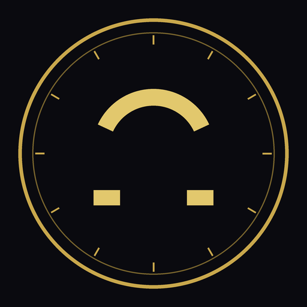

  

<h1 align="center">Ω SYD OMEGA 91717</h1>

<b>A private, membership-only personal growth and lifestyle platform</b>

---

## What Is SYD OMEGA 91717

SYD OMEGA 91717 is a private, invitation-based platform where approved
members track and grow every part of their life in one place — habits and
personal development, learning, finances, creative media, and community —
all inside a single, consistently designed experience.

The platform is built around a distinctive theme: each area is named and
styled after a system of zodiac signs, elements, and mythological figures.
This isn't decoration for its own sake — it gives every feature a memorable
identity and makes the platform's twelve guiding "agent" personas (each
representing a different area of focus, like security, growth, or finance)
easy to recognize as you move around the app.

Access is limited to approved members. It is not an open, public
sign-up service — every account is reviewed before it is granted full use
of the platform.

## What You'll Find Inside

Once you're a member, the platform is organized into clear areas, each
reachable from the sidebar:

- **Command** — Your personal dashboard: a snapshot of your progress,
  notifications, quick search, and the in-app AI concierge you can chat
  with for guidance.
- **Identity** — Your profile, membership passport, and account settings.
- **Ascend** — Where you build and track habits, take courses in the
  Academy, complete challenges, earn achievements and trophies, and sit
  exams to level up.
- **Cosmos** — The home of the platform's zodiac and elemental theme:
  your sign, your element, the AI agent personas, and the lore that ties
  it all together.
- **Vault** — Your financial home base: portfolio, wallet, subscription
  management, and the members' marketplace.
- **Order** — Community and family tools: manage your household or heirs,
  and connect with other members through shared halls and groups.
- **Services** — Bookable and requestable services: consultancy,
  publishing support, a production studio, marketing help, event
  planning, travel, and health & wellness resources.
- **Intel** — Research tools, personal analytics, automation helpers, and
  transparency/governance information about the platform itself.
- **Universe / Media** — A media library and creative content hub.

Each area shares the same look, feel, and navigation, so once you're
comfortable in one part of the platform, the rest feels familiar right
away.

## Becoming a Member

1. **Request access.** Visit the platform and submit an account request
   with your details.
2. **Wait for approval.** Every request is personally reviewed. While your
   request is pending, you'll see a status page confirming it's being
   processed.
3. **Get approved.** Once approved, you'll gain full access to your
   dashboard and every feature area described above.
4. **Set up your profile.** Complete your identity details so the
   platform can personalize your experience (your zodiac sign, element,
   and starting stats).

Membership can't be purchased or unlocked without approval — it exists to
keep the platform's community small, trusted, and personal.

## Using the Platform

- Start at your **Command** dashboard — it's your home base and shows
  what matters most at a glance.
- Use the sidebar to move between areas; each icon corresponds to one of
  the sections above.
- Track your habits and progress in **Ascend** to build your standing on
  the platform over time.
- Manage your money and holdings in **Vault**.
- Reach out for help any time through the in-app AI concierge in
  **Command**, or through the support channels listed in the app.

## Your Privacy

Your personal data belongs to you. The platform's in-app Privacy Centre
lets you review what's stored about you, control your consent
preferences, export your data, and request deletion of your account and
its data at any time. Full details are available in the app under
**Privacy** and **Terms**.

## Support & Contact

For access requests, questions, or help using the platform, use the
contact and support options available inside the app once you've signed
in, or on the pending-access page while your request is under review.

---

© SYD OMEGA 91717. All rights reserved. See the in-app Terms &amp; Privacy pages for full legal terms.

