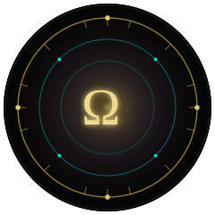
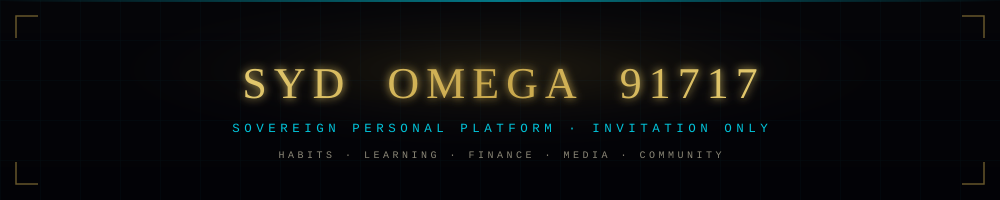

# Ω SYD OMEGA 91717

<strong>The Code. The Frequency. The Legacy.</strong> A governed, AI-native digital ecosystem designed to bring identity, knowledge, creation, intelligence, finance, heritage, media, and community into one coherent platform.

<a href="https://sydomega.com">Live Platform</a> · <a href="https://github.com/syd-omega-91717/sydomega-live">GitHub</a> · <a href="https://github.com/syd-omega-91717/sydomega-live/tree/main/docs">Documentation</a>

  

---

## ◈ What is Ω SYD OMEGA 91717?

**Ω SYD OMEGA 91717 is a single platform expressed through many domains.**

The product is designed around one governing idea:

> **One governed core. Many domain experiences. One coherent identity, policy, data, task, event, evidence, and release model.**

Instead of treating identity, learning, finance, media, family, gaming, intelligence, creation, and services as disconnected applications, Omega connects them through shared platform primitives while preserving explicit domain boundaries.

The result is intended to feel like **one living world rather than a collection of dashboards**.

The platform combines:

- Identity and personal profile
- Knowledge, education, and progression
- Intelligence, research, and AI-assisted workflows
- Creation, publishing, and media
- Family, heritage, and succession
- Finance, investment, commerce, and marketplace concepts
- Blockchain and digital-asset experiences
- Communication and community
- Gaming and achievement systems
- Governance, security, audit, and evidence
- A persistent world/graph layer connecting people, content, capabilities, tasks, and evidence

The visual language is deliberately cinematic and futuristic, but the underlying product model is **evidence-first and governance-driven**.

---

## Ω The Core Principle

Omega is not intended to become a giant collection of independent pages.

Its current architecture defines a **ONE_GOVERNED_CORE_MANY_DOMAIN_PROJECTIONS** operating model.

### The shared core

| Core | Responsibility |
|---|---|
| Identity & policy | Authentication, authorization, roles, ownership boundaries |
| Page contracts | What every page is for, what it reads, what it can do, and what evidence it requires |
| Capability registry | Canonical declaration of platform capabilities |
| Task fabric | User work from request → authorization → execution → verification |
| Data & content fabric | Canonical content, provenance, rights, lifecycle, and access policy |
| Event & evidence fabric | Durable events, evidence, lineage, replay, and auditability |
| Truth vocabulary | Clear distinction between live, calculated, simulated, lore, unavailable, blocked, and other states |
| Navigation & design | Shared information architecture and visual primitives |
| Release evidence | Production gates that distinguish source code from provider/runtime proof |

The governing flow is:

**SOURCE REQUIREMENT → DOMAIN → PAGE → CAPABILITY → TASK → AUTHORIZATION → EXECUTION → EVENT → EVIDENCE → TRUTH STATE → RELEASE STATE**

This prevents a visually complete feature from being mistaken for a production-complete feature.

---

## ✦ Product Domains

The current product architecture spans a broad set of specialist domains. They are projections of the shared core rather than independent platforms.

### Core experience
- Command
- Identity
- Progress
- Credentials
- Hierarchy
- Intelligence

### Knowledge & human development
- Consultancy
- Academy / learning
- Achievements
- Horoscope / symbolic systems
- Heritage
- Family and lineage

### Creation & media
- Media
- Publishing
- Creation Studio
- Games and gaming experiences
- Characters and world-building

### Finance & digital economy
- Investment
- Economy
- Marketplace
- Blockchain
- Crypto
- NFT / digital assets
- Wallet / vault concepts

### Communication & services
- Communication
- Social experiences
- Notifications
- Services
- Legal
- Events
- Travel
- Wellbeing

The repository currently contains a **238-page estate** governed by page contracts. The platform is intentionally being consolidated around shared contracts rather than allowing every page to invent its own rules.

---

## ◎ Agents & Intelligence

Omega's conceptual agent layer includes twelve governed roles:

**Sentinel · Analyst · Historian · Tutor · Merchant · Proxy · Oracle · Scout · Warden · Auditor · Beacon · Sovereign**

These roles are treated as capabilities within a governed platform model, not as permission to bypass authorization.

AI features are expected to:

1. Use authoritative sources where available.
2. Preserve provenance and evidence.
3. Respect identity and authorization boundaries.
4. Distinguish generated or inferred information from verified facts.
5. Fail closed for sensitive operations.
6. Record the evidence needed to understand important actions.
7. Never turn a prompt, UI state, or client-side calculation into authoritative financial, security, ownership, or deployment truth.

---

## ◇ Truth Is a First-Class Product Feature

Omega deliberately avoids presenting every number, card, achievement, balance, or status as real merely because a UI can render it.

The platform's unified truth vocabulary includes states such as:

**LIVE · IMPLEMENTED · RUNTIME-VERIFIED · PRODUCTION-VERIFIED · PARTIAL · CALCULATED · SIMULATED · USER-CREATED · EMPTY · UNAVAILABLE · UNVERIFIED · BLOCKED · LORE · FUTURE · REJECTED · REPLACED**

This matters for a platform that combines real-world services with simulation, narrative, visualization, AI, and game-like progression.

### Example

A simulated market scenario can be valuable. It must simply be presented as **SIMULATED**, not as a live financial result.

A calculated progression score can be useful. It must not be represented as provider-verified authority unless the required evidence exists.

This distinction is part of the architecture, not merely a UI convention.

---

## ▲ Evidence-First Engineering

Omega uses an explicit production-readiness ladder:

**SPECIFIED → IMPLEMENTED → CONNECTED → PERSISTED → SECURED → TESTED → DEPLOYED → LIVE-VERIFIED**

A source file, SQL migration, UI component, or successful local test does not by itself prove provider-side production behavior.

The repository therefore maintains release evidence and production gates covering areas including:

- Supabase security
- RLS and database performance
- RPC privilege boundaries
- Migration reproducibility
- Payment lifecycle
- Disaster recovery
- Privacy lifecycle
- Provider credentials
- Scale and capacity
- AI quality
- Vercel production deployment
- Owner security

Some of these gates are intentionally **PENDING**, **PARTIAL**, or **BLOCKED** until provider-side evidence exists.

That is deliberate.

**Omega does not use a green-looking README to hide a red production dependency.**

---

## ⚙️ Current Technology Model

Omega intentionally preserves a lightweight architecture rather than rewriting the product into a framework-heavy monorepo.

### Web
- Framework-free static web estate
- Shared JavaScript modules
- Shared navigation and design primitives
- Progressive enhancement where appropriate
- Dark-only Ω visual system
- Responsive interfaces
- Accessibility and usability contracts

### Backend & data
- Supabase
- PostgreSQL
- Row Level Security
- Supabase Edge Functions
- Private storage
- Event and evidence persistence
- Data lineage
- Capability registry
- Task completion records
- Feature flags
- Presence and activity infrastructure

### Delivery
- GitHub
- GitHub Actions / repository contract gates
- Vercel
- Explicit release and production evidence controls

### Runtime services
The live Supabase environment currently exposes a governed Edge Function estate including:

- Concierge
- Concierge Orchestrator
- Growth Orchestrator
- Product Orchestrator
- Stripe Webhook
- Secrets Health
- Agent Execute
- Evidence Graph
- Notification Worker
- Runtime Gateway
- Media Worker
- Intelligence Feed
- Provider Worker
- Knowledge Embedding Worker
- Content Ingest
- Content Delivery

**Runtime parity is separately audited; repository source is not treated as proof that every function is deployed identically.**

---

## ◇ Security & Governance

Security is part of the product architecture, not a final checklist.

The project incorporates controls and patterns for:

- Authentication and authorization
- RBAC / policy boundaries
- Row Level Security
- MFA-sensitive action policy
- Private storage
- Secure file handling
- Audit events
- Evidence and lineage
- Secrets hygiene
- Security headers
- Content Security Policy
- Secure deployment
- Failure and retry handling
- Production evidence gates
- Privacy lifecycle controls

The project also tracks unresolved provider-side and operational work openly rather than disguising it as complete.

See:

- [Unified Architecture & Trust Enforcement](docs/OMEGA_UNIFIED_ARCHITECTURE_TRUST_ENFORCEMENT_MODEL.md)
- [Unified Platform Fabric](config/omega-unified-platform-fabric.json)
- [Production 10/10 Evidence Gate](config/omega-production-10-10-evidence-gate.json)
- [Edge Runtime Parity Control](docs/OMEGA_EDGE_RUNTIME_PARITY_CONTROL.md)

---

## ◈ Experience Philosophy

Omega's interface is designed to combine **clarity with atmosphere**.

### Visual language
- Ω as the primary emblem
- Dark-first / dark-only presentation
- Gold as the sovereign accent
- Cyan for intelligence and active system states
- Cinematic glass and layered depth
- Motion used to communicate state, not decorate every surface
- Large, readable typography
- Persistent navigation
- Clear hierarchy
- Selective 3D rather than gratuitous 3D
- Data and system state presented as living information where real telemetry exists

### Product rule

**A beautiful interface is not enough.**

Every important page should have a job.

Every capability should have an owner.

Every task should have an outcome.

Every sensitive action should have an authorization boundary.

Every important state should have a truth classification.

Every production claim should have evidence.

---

## ⌁ How the Platform Evolves

The project is deliberately developed as a continuously improving system.

Enhancement work is expected to examine:

- Architecture
- Security
- Scalability
- Reliability
- AI opportunities
- Data quality
- Automation
- UX
- Accessibility
- Performance
- Observability
- Testing
- Legal and compliance requirements
- Documentation
- Business economics
- Operational cost
- Maintainability
- Governance

The project benchmark philosophy is to extract **principles**, not proprietary implementations, from strong engineering and product organizations.

The goal is not to imitate another platform. The goal is to understand why a proven pattern works and adapt the underlying principle to Omega's architecture.

---

## 🧭 Repository Navigation

Start here:

| Area | Purpose |
|---|---|
| [`docs/`](docs/) | Architecture, governance, production controls, operating model |
| [`config/`](config/) | Canonical contracts, registries, evidence gates, product definitions |
| [`scripts/`](scripts/) | Contract checks, audits, validation, release tooling |
| [`public/`](public/) | Static production assets and web estate |
| [`supabase/`](supabase/) | Database migrations, functions, and Supabase runtime source |
| [`assets/`](assets/) | Ω visual identity and shared assets |

Useful architecture documents:

- [`OMEGA_UNIFIED_ARCHITECTURE_TRUST_ENFORCEMENT_MODEL.md`](docs/OMEGA_UNIFIED_ARCHITECTURE_TRUST_ENFORCEMENT_MODEL.md)
- [`OMEGA_PLATFORM_AS_PRODUCT_OPERATING_MODEL.md`](docs/OMEGA_PLATFORM_AS_PRODUCT_OPERATING_MODEL.md)
- [`OMEGA_EDGE_RUNTIME_PARITY_CONTROL.md`](docs/OMEGA_EDGE_RUNTIME_PARITY_CONTROL.md)
- [`omega-unified-platform-fabric.json`](config/omega-unified-platform-fabric.json)
- [`omega-production-10-10-evidence-gate.json`](config/omega-production-10-10-evidence-gate.json)

---

## 🛠 Development Principles

Before adding a feature, answer:

1. **What user problem does this solve?**
2. **Which domain owns it?**
3. **Which canonical capability does it use?**
4. **Which authoritative data source does it require?**
5. **Who is allowed to perform the action?**
6. **What happens for unauthorized users?**
7. **What is the truth state?**
8. **What events and evidence are required?**
9. **How does it fail and retry?**
10. **How is it tested?**
11. **What proves it works in the real provider environment?**
12. **How is it rolled back or retired?**
13. **Who owns its operational cost and residual risk?**

### Definition of done

A feature is not considered production-complete merely because:

- its page renders;
- its JavaScript exists;
- a SQL migration exists;
- a prompt exists;
- a static test passes; or
- a UI control appears clickable.

Production completion requires the applicable contract, authorization cases, negative cases, failure handling, traceability, tests, runtime evidence, deployment evidence, and rollback path.

---

## 🚀 Local Development

The repository is intentionally a static-site architecture.

The current package metadata targets:

- Node.js `>=20.11.0`
- npm `>=10`

There is no framework migration required to work on the existing web estate.

For repository-specific setup and operational procedures, use the documentation under [`docs/`](docs/) and the repository scripts rather than assuming a conventional React/Vite/Next.js workflow.

### Important

Do not commit:

- API keys
- access tokens
- service-role credentials
- private provider credentials
- real payment secrets
- personal identity data

Use provider-managed secret storage and the repository's existing secret-handling controls.

---

## 🌐 Production

**Primary platform:** [sydomega.com](https://sydomega.com)

The production estate is delivered through Vercel and uses Supabase for backend/data capabilities.

Production readiness is continuously verified rather than assumed.

For the authoritative state of release readiness, use:

[`config/omega-production-10-10-evidence-gate.json`](config/omega-production-10-10-evidence-gate.json)

For live provider/runtime parity, use:

[`docs/OMEGA_EDGE_RUNTIME_PARITY_CONTROL.md`](docs/OMEGA_EDGE_RUNTIME_PARITY_CONTROL.md)

---

## ◉ Privacy & User Control

Omega is designed around the principle that users should be able to understand and control their data.

The platform architecture therefore treats privacy as a lifecycle:

**COLLECT → USE → PROTECT → DISCLOSE → RETAIN → EXPORT → ERASE**

The implementation and provider evidence for each stage must be verified independently.

Do not interpret the word **sovereign** as a legal exemption from privacy, financial, security, intellectual-property, accessibility, or other applicable obligations.

---

## 📚 Design & Engineering References

The project's engineering direction is informed by reusable principles from areas including:

- Zero Trust security
- NIST Cybersecurity Framework
- NIST AI Risk Management Framework
- OWASP application and file-upload security
- WebAuthn / strong authentication
- SRE reliability and error-budget thinking
- Secure software supply chains
- Privacy-by-design
- Accessibility engineering
- Evidence-driven release management
- Platform engineering and Team Topologies

The project adopts principles; it does not claim affiliation with or endorsement by those organizations.

---

## ✦ Project Status

**Architecture:** Active and continuously evolving

**Operating model:** One governed core, many domain projections

**Web estate:** 238 pages under canonical page-contract governance

**Backend:** Supabase PostgreSQL + RLS + Edge Functions + Storage

**Delivery:** GitHub + Vercel

**Production posture:** Evidence-driven; several provider/runtime gates remain explicitly pending, partial, or blocked

**Goal:** A durable, secure, intelligible, extensible global digital ecosystem

The most important status rule is simple:

> **If there is no evidence, Omega says so.**

---

## Ω The Vision

The long-term objective is larger than a website.

Omega is being developed as a **persistent digital ecosystem** in which:

- identity has continuity;
- knowledge compounds;
- creation becomes structured;
- intelligence is contextual;
- relationships can be represented safely;
- content has provenance;
- actions create durable evidence;
- progression has meaning;
- domains remain connected without becoming tangled;
- governance scales with capability;
- and the system can evolve without losing architectural coherence.

**One platform. Many worlds. One governed core.**

Ω SYD OMEGA 91717 · The Code. The Frequency. The Legacy.
