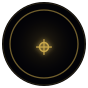
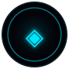
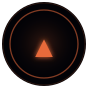
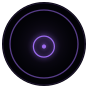
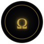
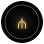
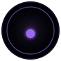

  

  

  
  
  
  
  

  

## ⌖&nbsp;&nbsp;What This Is

Most people run their life through a dozen disconnected apps — one for
habits, one for money, one for learning, one for the people they care
about. Each holds a fragment. None of them holds the person.

**SYD OMEGA 91717 exists to end that fragmentation.** It is a single,
private realm where the things that actually compose a life — discipline,
knowledge, wealth, lineage, creation, and community — live under one
roof, one identity, and one design language.

**Membership is invitation-only.** Every request is reviewed by hand.
Entry is not purchased and never auto-granted. Once approved, every member
receives their own zodiac sign, element, and guiding persona — a
coordinate that is genuinely theirs, assigned by the platform itself, never
chosen.

It is not a productivity app with a theme on top. The mythology *is* the
architecture: signs, elements, and guiding personas are the navigation
system, the progress model, and the vocabulary all at once. Learn your
sign and your element once, and you already know your way through every
realm.

  

## ✧&nbsp;&nbsp;What It Represents

Three convictions shape everything here.

**A life is one system, not twelve dashboards.** Progress in discipline
should visibly move standing in the wider realm. Knowledge earned should
compound into authority. What you build should be inheritable. The
platform is designed so these are literally connected, not merely
adjacent.

**Meaning should be structural.** Every member receives a sign, an
element, and a guiding persona at genesis — assigned, never chosen, and
evolved only through what you actually do. Twelve signs, nine elements,
and a lattice of positions give each member a coordinate that is genuinely
theirs, and a language shared with everyone else inside.

**Sovereignty is literal, not marketing.** *Sovereign* here describes who
holds the keys. The realm is governed by a single Architect. Entry is by
invitation and reviewed by hand. And your data, once inside, is yours —
to inspect, to export, or to erase entirely, whenever you decide.

  

## ◈&nbsp;&nbsp;The Nine Realms

The platform unfolds into nine realms, each with its own identity, colour
and purpose — all reached from a single compass that never changes shape
as you move between them. Every realm is wired into the standing system, so
progress in one is visibly connected to authority across all nine.

<table>
<tr>
<td align="center" width="140"> <b>Command</b></td>
<td><b>Home Base</b> — A live dashboard of your standing, what needs attention now, universal search, and an in-app AI assistant that answers in context. Your entry point every session.</td>
</tr>
<tr>
<td align="center"> <b>Identity</b></td>
<td><b>Who You Are</b> — Your sign, element, guiding persona, membership tier, character record, and the settings that govern your presence and privacy. Your profile and passport within the Order.</td>
</tr>
<tr>
<td align="center"> <b>Ascend</b></td>
<td><b>Progression</b> — Where standing is earned through discipline. Daily practices, the Academy (learning), trials, challenges, honours, and examinations that mark real advancement. Standing builds toward gates that unlock new capabilities.</td>
</tr>
<tr>
<td align="center"> <b>Cosmos</b></td>
<td><b>The Canon</b> — The map of meaning: twelve zodiac signs, nine elements, guiding personas for each combination, the gates of authority, and the mythology that binds the entire platform.</td>
</tr>
<tr>
<td align="center"> <b>Vault</b></td>
<td><b>Your Holdings</b> — Reserves, wealth tracking, membership standing status, cosmetic purchases, and access to the members' marketplace. Where you see what you own.</td>
</tr>
<tr>
<td align="center"> <b>Order</b></td>
<td><b>People & Lineage</b> — Household and family, succession and inheritance, shared halls, and the circles you belong to. Your social and familial presence within the realm.</td>
</tr>
<tr>
<td align="center"> <b>Services</b></td>
<td><b>What The Realm Provides</b> — Counsel and guidance, publishing tools, a production studio, event management, travel coordination, and wellbeing resources curated for your progress.</td>
</tr>
<tr>
<td align="center"> <b>Intel</b></td>
<td><b>Understanding & Governance</b> — Research, knowledge mapping, personal analytics on your progress, automation, and governance tools for realm administration.</td>
</tr>
<tr>
<td align="center"> <b>Universe</b></td>
<td><b>Library & Creation</b> — Your archive of everything worth keeping: media, notes, creations, favorites, and the tools to make and store new work.</td>
</tr>
</table>

Every realm speaks the same visual language and shares the same compass
navigation, so the moment one feels familiar, the rest already do. Your
standing grows across all of them simultaneously.

  

## ◎&nbsp;&nbsp;How Standing Works

Nothing here is a vanity number. Standing is built from three axes that
correspond to genuinely different kinds of effort:

<table>
<tr><td align="center" width="120"><b>Axis A</b> Knowledge</td><td>What you have learned and can demonstrate — study, reading, examination, and mastery of the platform's canon and your own skill.</td></tr>
<tr><td align="center"><b>Axis B</b> Mastery</td><td>What you have practiced until it holds — discipline sustained over time, daily habits, consistency, not intensity in bursts.</td></tr>
<tr><td align="center"><b>Axis C</b> Contribution</td><td>What you have given to the realm and the people in it — support, creation, sharing, community building.</td></tr>
</table>

**The Authority Score:** The three axes combine into a single authority
score. As it rises, you unlock **Gates** — thresholds that mark genuine
changes in what you can reach and do. Tiers range from 1–9, with each
tier unlocking new realms, features, and capabilities.

Gates are not purchases and cannot be skipped. Progression is deliberately
slow at the edges and impossible to shortcut: your standing reflects
genuine effort over time, and a standing that can be bought is not a
standing.

**Inheritance & Legacy:** Your character evolves alongside your standing.
Traits, achievements, and authority pass to your heirs, merge into the
bloodline, and carry the Order across generations — making your progress
tangible beyond your own lifetime.

  

## ⊙&nbsp;&nbsp;Signs, Elements & Personas

Every member receives three permanent assignments at genesis, never chosen,
only evolved through what you actually do:

**Twelve Signs** — Your zodiac identity (Aries through Pisces). Each sign
carries distinct traits and alignments that shape how the platform works
for you.

**Nine Elements** — Your elemental nature (Fire, Water, Earth, Air, plus
four composites). Elements determine visual theming, energy type, and how
you interact with the realm's mechanics.

**Guiding Personas** — A role that pairs your sign and element (e.g.,
Sentinel, Merchant, Scout, Warden, Sovereign, Auditor, Proxy, Oracle,
Beacon, Analyst, Tutor, Historian). Each persona owns a domain and a voice
within the platform, shaping the AI assistant's guidance and the language
of your own progress.

These three work together as your coordinate within the Order — genuinely
unique, non-transferable, and the foundation of how the platform knows you.

  

## ▲&nbsp;&nbsp;The Path to Membership

Membership is invitation-only and hand-reviewed. There is no instant signup,
no payment that skips the queue, and no auto-grant. Every request is read
personally by the Architect.

<table>
<tr>
<td align="center" width="70"><b>I</b></td>
<td><b>Request</b> — Ask for entry through the front door. A form captures your interest, background, and intent. You'll receive a response confirming receipt.</td>
</tr>
<tr>
<td align="center"><b>II</b></td>
<td><b>Review</b> — Your request enters a queue and is read by hand. A live status page shows exactly where things stand — pending, under review, or decision reached. The wait is transparent.</td>
</tr>
<tr>
<td align="center"><b>III</b></td>
<td><b>Approval</b> — Once approved, you gain instant access to all nine realms. Your profile is created and waiting. You are now a member.</td>
</tr>
<tr>
<td align="center"><b>IV</b></td>
<td><b>Ascension</b> — Complete your genesis ritual to be assigned your zodiac sign, element, and guiding persona. This reveals your unique coordinate within the Order and unlocks your personalized experience.</td>
</tr>
</table>

**Why this matters:** Membership by approval keeps the realm small, trusted,
and inhabited by people who genuinely want to be here. Vetting by hand means
every member is known. Your sign, element, and persona are gifts, not
purchases, and they cannot be transferred — they belong to you alone.

  

## ☉&nbsp;&nbsp;Finding Your Way

**When you first arrive:**

- **Start in Command.** It is your home. It shows what changed, what needs
  attention, your current standing across all three axes, and your standing
  relative to the nine gates. Universal search is here.
- **Read your identity once.** Learn your sign, element, and guiding
  persona in the Identity realm. This coordinate is yours forever — use
  language and icons that flow from it wherever you go.
- **Walk the Compass.** A single compass sidebar lives on every page. Each
  of the nine icons leads to a realm. The compass never changes shape or
  location — memorize it once and you know how to reach everywhere.

**As you build:**

- **Build in Ascend.** Small, repeated acts (daily practices, learning,
  contribution) compound into standing far faster than occasional large
  acts. The system rewards consistency.
- **Watch your standing grow.** Every realm's work moves all three axes.
  Progress in one realm is visible across all nine. You are building one
  life, not managing nine tasks.
- **Ask the AI when unsure.** A guiding intelligence lives in Command and
  knows who you are, where you are, and what you are looking at. It speaks
  in your persona's voice and answers in context.

  

## Ω&nbsp;&nbsp;Your Privacy, Your Sovereignty

Your data belongs to you. That is the whole point of the word "sovereignty."

**What you control:**

- **See everything.** The Privacy Centre shows exactly what data the platform holds about you: your profile, standing, every action, every note, every connection.
- **Adjust consent.** You control what telemetry and features are active. Turn off tracking, analytics, or communication features anytime.
- **Export your life.** Download your complete account data in a standard format. Everything you've built, learned, created, and contributed is yours to take.
- **Erase on demand.** Request permanent deletion of your account and all its contents. No queue, no waiting for support — the button is in the app.

**How we respect it:**

- **Closed to search engines.** The realm is not indexed by Google, Bing, or any public search engine.
- **Closed to the public.** What happens inside stays between the members and the Architect. No data is sold, rented, or shared with third parties.
- **End-to-end is optional, not forced.** Sensitive data can be encrypted if you choose, and the keys are yours alone.
- **Audit trails for you.** Every access to your data is logged and visible to you. If someone else views your profile, you know.

Full legal terms are available in-app under **Privacy** and **Terms**. They
are written in plain language, not legalese, because this is your data and you
deserve to understand what we do with it.

  

## ✦&nbsp;&nbsp;Requesting Access

SYD OMEGA 91717 is invitation-only, but new requests are always reviewed.

- **No instant signup** — your request is read by hand and answered personally.
- **No payment required** — membership cannot be purchased.
- **Transparent tracking** — while your request is pending, a status page shows exactly where it stands.

To request access, visit the platform's front door. Submit a brief note about
yourself and why you're interested. Someone will read it and respond.

**Once you're a member:**

Use the contact options inside the platform for questions, support, or help
finding your way. You can also reach out while your request is under review
through the pending-access page.

  

  

© SYD OMEGA 91717 &middot; All rights reserved &middot; See the in-app Terms &amp; Privacy pages for full legal terms

# Ω SYD OMEGA 91717

<strong>The Code. The Frequency. The Legacy.</strong> A governed, AI-native digital ecosystem designed to bring identity, knowledge, creation, intelligence, finance, heritage, media, and community into one coherent platform.

<a href="https://sydomega.com">Live Platform</a> · <a href="https://github.com/syd-omega-91717/sydomega-live">GitHub</a> · <a href="https://github.com/syd-omega-91717/sydomega-live/tree/main/docs">Documentation</a>

  

---

## ◈ What is Ω SYD OMEGA 91717?

**Ω SYD OMEGA 91717 is a single platform expressed through many domains.**

The product is designed around one governing idea:

> **One governed core. Many domain experiences. One coherent identity, policy, data, task, event, evidence, and release model.**

Instead of treating identity, learning, finance, media, family, gaming, intelligence, creation, and services as disconnected applications, Omega connects them through shared platform primitives while preserving explicit domain boundaries.

The result is intended to feel like **one living world rather than a collection of dashboards**.

The platform combines:

- Identity and personal profile
- Knowledge, education, and progression
- Intelligence, research, and AI-assisted workflows
- Creation, publishing, and media
- Family, heritage, and succession
- Finance, investment, commerce, and marketplace concepts
- Blockchain and digital-asset experiences
- Communication and community
- Gaming and achievement systems
- Governance, security, audit, and evidence
- A persistent world/graph layer connecting people, content, capabilities, tasks, and evidence

The visual language is deliberately cinematic and futuristic, but the underlying product model is **evidence-first and governance-driven**.

---

## Ω The Core Principle

Omega is not intended to become a giant collection of independent pages.

Its current architecture defines a **ONE_GOVERNED_CORE_MANY_DOMAIN_PROJECTIONS** operating model.

### The shared core

| Core | Responsibility |
|---|---|
| Identity & policy | Authentication, authorization, roles, ownership boundaries |
| Page contracts | What every page is for, what it reads, what it can do, and what evidence it requires |
| Capability registry | Canonical declaration of platform capabilities |
| Task fabric | User work from request → authorization → execution → verification |
| Data & content fabric | Canonical content, provenance, rights, lifecycle, and access policy |
| Event & evidence fabric | Durable events, evidence, lineage, replay, and auditability |
| Truth vocabulary | Clear distinction between live, calculated, simulated, lore, unavailable, blocked, and other states |
| Navigation & design | Shared information architecture and visual primitives |
| Release evidence | Production gates that distinguish source code from provider/runtime proof |

The governing flow is:

**SOURCE REQUIREMENT → DOMAIN → PAGE → CAPABILITY → TASK → AUTHORIZATION → EXECUTION → EVENT → EVIDENCE → TRUTH STATE → RELEASE STATE**

This prevents a visually complete feature from being mistaken for a production-complete feature.

---

## ✦ Product Domains

The current product architecture spans a broad set of specialist domains. They are projections of the shared core rather than independent platforms.

### Core experience
- Command
- Identity
- Progress
- Credentials
- Hierarchy
- Intelligence

### Knowledge & human development
- Consultancy
- Academy / learning
- Achievements
- Horoscope / symbolic systems
- Heritage
- Family and lineage

### Creation & media
- Media
- Publishing
- Creation Studio
- Games and gaming experiences
- Characters and world-building

### Finance & digital economy
- Investment
- Economy
- Marketplace
- Blockchain
- Crypto
- NFT / digital assets
- Wallet / vault concepts

### Communication & services
- Communication
- Social experiences
- Notifications
- Services
- Legal
- Events
- Travel
- Wellbeing

The repository currently contains a **238-page estate** governed by page contracts. The platform is intentionally being consolidated around shared contracts rather than allowing every page to invent its own rules.

---

## ◎ Agents & Intelligence

Omega's conceptual agent layer includes twelve governed roles:

**Sentinel · Analyst · Historian · Tutor · Merchant · Proxy · Oracle · Scout · Warden · Auditor · Beacon · Sovereign**

These roles are treated as capabilities within a governed platform model, not as permission to bypass authorization.

AI features are expected to:

1. Use authoritative sources where available.
2. Preserve provenance and evidence.
3. Respect identity and authorization boundaries.
4. Distinguish generated or inferred information from verified facts.
5. Fail closed for sensitive operations.
6. Record the evidence needed to understand important actions.
7. Never turn a prompt, UI state, or client-side calculation into authoritative financial, security, ownership, or deployment truth.

---

## ◇ Truth Is a First-Class Product Feature

Omega deliberately avoids presenting every number, card, achievement, balance, or status as real merely because a UI can render it.

The platform's unified truth vocabulary includes states such as:

**LIVE · IMPLEMENTED · RUNTIME-VERIFIED · PRODUCTION-VERIFIED · PARTIAL · CALCULATED · SIMULATED · USER-CREATED · EMPTY · UNAVAILABLE · UNVERIFIED · BLOCKED · LORE · FUTURE · REJECTED · REPLACED**

This matters for a platform that combines real-world services with simulation, narrative, visualization, AI, and game-like progression.

### Example

A simulated market scenario can be valuable. It must simply be presented as **SIMULATED**, not as a live financial result.

A calculated progression score can be useful. It must not be represented as provider-verified authority unless the required evidence exists.

This distinction is part of the architecture, not merely a UI convention.

---

## ▲ Evidence-First Engineering

Omega uses an explicit production-readiness ladder:

**SPECIFIED → IMPLEMENTED → CONNECTED → PERSISTED → SECURED → TESTED → DEPLOYED → LIVE-VERIFIED**

A source file, SQL migration, UI component, or successful local test does not by itself prove provider-side production behavior.

The repository therefore maintains release evidence and production gates covering areas including:

- Supabase security
- RLS and database performance
- RPC privilege boundaries
- Migration reproducibility
- Payment lifecycle
- Disaster recovery
- Privacy lifecycle
- Provider credentials
- Scale and capacity
- AI quality
- Vercel production deployment
- Owner security

Some of these gates are intentionally **PENDING**, **PARTIAL**, or **BLOCKED** until provider-side evidence exists.

That is deliberate.

**Omega does not use a green-looking README to hide a red production dependency.**

---

## ⚙️ Current Technology Model

Omega intentionally preserves a lightweight architecture rather than rewriting the product into a framework-heavy monorepo.

### Web
- Framework-free static web estate
- Shared JavaScript modules
- Shared navigation and design primitives
- Progressive enhancement where appropriate
- Dark-only Ω visual system
- Responsive interfaces
- Accessibility and usability contracts

### Backend & data
- Supabase
- PostgreSQL
- Row Level Security
- Supabase Edge Functions
- Private storage
- Event and evidence persistence
- Data lineage
- Capability registry
- Task completion records
- Feature flags
- Presence and activity infrastructure

### Delivery
- GitHub
- GitHub Actions / repository contract gates
- Vercel
- Explicit release and production evidence controls

### Runtime services
The live Supabase environment currently exposes a governed Edge Function estate including:

- Concierge
- Concierge Orchestrator
- Growth Orchestrator
- Product Orchestrator
- Stripe Webhook
- Secrets Health
- Agent Execute
- Evidence Graph
- Notification Worker
- Runtime Gateway
- Media Worker
- Intelligence Feed
- Provider Worker
- Knowledge Embedding Worker
- Content Ingest
- Content Delivery

**Runtime parity is separately audited; repository source is not treated as proof that every function is deployed identically.**

---

## ◇ Security & Governance

Security is part of the product architecture, not a final checklist.

The project incorporates controls and patterns for:

- Authentication and authorization
- RBAC / policy boundaries
- Row Level Security
- MFA-sensitive action policy
- Private storage
- Secure file handling
- Audit events
- Evidence and lineage
- Secrets hygiene
- Security headers
- Content Security Policy
- Secure deployment
- Failure and retry handling
- Production evidence gates
- Privacy lifecycle controls

The project also tracks unresolved provider-side and operational work openly rather than disguising it as complete.

See:

- [Unified Architecture & Trust Enforcement](docs/OMEGA_UNIFIED_ARCHITECTURE_TRUST_ENFORCEMENT_MODEL.md)
- [Unified Platform Fabric](config/omega-unified-platform-fabric.json)
- [Production 10/10 Evidence Gate](config/omega-production-10-10-evidence-gate.json)
- [Edge Runtime Parity Control](docs/OMEGA_EDGE_RUNTIME_PARITY_CONTROL.md)

---

## ◈ Experience Philosophy

Omega's interface is designed to combine **clarity with atmosphere**.

### Visual language
- Ω as the primary emblem
- Dark-first / dark-only presentation
- Gold as the sovereign accent
- Cyan for intelligence and active system states
- Cinematic glass and layered depth
- Motion used to communicate state, not decorate every surface
- Large, readable typography
- Persistent navigation
- Clear hierarchy
- Selective 3D rather than gratuitous 3D
- Data and system state presented as living information where real telemetry exists

### Product rule

**A beautiful interface is not enough.**

Every important page should have a job.

Every capability should have an owner.

Every task should have an outcome.

Every sensitive action should have an authorization boundary.

Every important state should have a truth classification.

Every production claim should have evidence.

---

## ⌁ How the Platform Evolves

The project is deliberately developed as a continuously improving system.

Enhancement work is expected to examine:

- Architecture
- Security
- Scalability
- Reliability
- AI opportunities
- Data quality
- Automation
- UX
- Accessibility
- Performance
- Observability
- Testing
- Legal and compliance requirements
- Documentation
- Business economics
- Operational cost
- Maintainability
- Governance

The project benchmark philosophy is to extract **principles**, not proprietary implementations, from strong engineering and product organizations.

The goal is not to imitate another platform. The goal is to understand why a proven pattern works and adapt the underlying principle to Omega's architecture.

---

## 🧭 Repository Navigation

Start here:

| Area | Purpose |
|---|---|
| [`docs/`](docs/) | Architecture, governance, production controls, operating model |
| [`config/`](config/) | Canonical contracts, registries, evidence gates, product definitions |
| [`scripts/`](scripts/) | Contract checks, audits, validation, release tooling |
| [`public/`](public/) | Static production assets and web estate |
| [`supabase/`](supabase/) | Database migrations, functions, and Supabase runtime source |
| [`assets/`](assets/) | Ω visual identity and shared assets |

Useful architecture documents:

- [`OMEGA_UNIFIED_ARCHITECTURE_TRUST_ENFORCEMENT_MODEL.md`](docs/OMEGA_UNIFIED_ARCHITECTURE_TRUST_ENFORCEMENT_MODEL.md)
- [`OMEGA_PLATFORM_AS_PRODUCT_OPERATING_MODEL.md`](docs/OMEGA_PLATFORM_AS_PRODUCT_OPERATING_MODEL.md)
- [`OMEGA_EDGE_RUNTIME_PARITY_CONTROL.md`](docs/OMEGA_EDGE_RUNTIME_PARITY_CONTROL.md)
- [`omega-unified-platform-fabric.json`](config/omega-unified-platform-fabric.json)
- [`omega-production-10-10-evidence-gate.json`](config/omega-production-10-10-evidence-gate.json)

---

## 🛠 Development Principles

Before adding a feature, answer:

1. **What user problem does this solve?**
2. **Which domain owns it?**
3. **Which canonical capability does it use?**
4. **Which authoritative data source does it require?**
5. **Who is allowed to perform the action?**
6. **What happens for unauthorized users?**
7. **What is the truth state?**
8. **What events and evidence are required?**
9. **How does it fail and retry?**
10. **How is it tested?**
11. **What proves it works in the real provider environment?**
12. **How is it rolled back or retired?**
13. **Who owns its operational cost and residual risk?**

### Definition of done

A feature is not considered production-complete merely because:

- its page renders;
- its JavaScript exists;
- a SQL migration exists;
- a prompt exists;
- a static test passes; or
- a UI control appears clickable.

Production completion requires the applicable contract, authorization cases, negative cases, failure handling, traceability, tests, runtime evidence, deployment evidence, and rollback path.

---

## 🚀 Local Development

The repository is intentionally a static-site architecture.

The current package metadata targets:

- Node.js `>=20.11.0`
- npm `>=10`

There is no framework migration required to work on the existing web estate.

For repository-specific setup and operational procedures, use the documentation under [`docs/`](docs/) and the repository scripts rather than assuming a conventional React/Vite/Next.js workflow.

### Important

Do not commit:

- API keys
- access tokens
- service-role credentials
- private provider credentials
- real payment secrets
- personal identity data

Use provider-managed secret storage and the repository's existing secret-handling controls.

---

## 🌐 Production

**Primary platform:** [sydomega.com](https://sydomega.com)

The production estate is delivered through Vercel and uses Supabase for backend/data capabilities.

Production readiness is continuously verified rather than assumed.

For the authoritative state of release readiness, use:

[`config/omega-production-10-10-evidence-gate.json`](config/omega-production-10-10-evidence-gate.json)

For live provider/runtime parity, use:

[`docs/OMEGA_EDGE_RUNTIME_PARITY_CONTROL.md`](docs/OMEGA_EDGE_RUNTIME_PARITY_CONTROL.md)

---

## ◉ Privacy & User Control

Omega is designed around the principle that users should be able to understand and control their data.

The platform architecture therefore treats privacy as a lifecycle:

**COLLECT → USE → PROTECT → DISCLOSE → RETAIN → EXPORT → ERASE**

The implementation and provider evidence for each stage must be verified independently.

Do not interpret the word **sovereign** as a legal exemption from privacy, financial, security, intellectual-property, accessibility, or other applicable obligations.

---

## 📚 Design & Engineering References

The project's engineering direction is informed by reusable principles from areas including:

- Zero Trust security
- NIST Cybersecurity Framework
- NIST AI Risk Management Framework
- OWASP application and file-upload security
- WebAuthn / strong authentication
- SRE reliability and error-budget thinking
- Secure software supply chains
- Privacy-by-design
- Accessibility engineering
- Evidence-driven release management
- Platform engineering and Team Topologies

The project adopts principles; it does not claim affiliation with or endorsement by those organizations.

---

## ✦ Project Status

**Architecture:** Active and continuously evolving

**Operating model:** One governed core, many domain projections

**Web estate:** 238 pages under canonical page-contract governance

**Backend:** Supabase PostgreSQL + RLS + Edge Functions + Storage

**Delivery:** GitHub + Vercel

**Production posture:** Evidence-driven; several provider/runtime gates remain explicitly pending, partial, or blocked

**Goal:** A durable, secure, intelligible, extensible global digital ecosystem

The most important status rule is simple:

> **If there is no evidence, Omega says so.**

---

## Ω The Vision

The long-term objective is larger than a website.

Omega is being developed as a **persistent digital ecosystem** in which:

- identity has continuity;
- knowledge compounds;
- creation becomes structured;
- intelligence is contextual;
- relationships can be represented safely;
- content has provenance;
- actions create durable evidence;
- progression has meaning;
- domains remain connected without becoming tangled;
- governance scales with capability;
- and the system can evolve without losing architectural coherence.

**One platform. Many worlds. One governed core.**

Ω SYD OMEGA 91717 · The Code. The Frequency. The Legacy.

